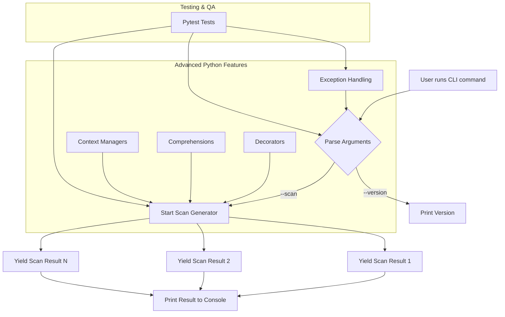

# SentinelOps Project

**Project Name:** SentinelOps  
**Type:** Python CLI Security/Scanning Tool (learning-focused)  
**Owner:** Glenn Lewis
[Kanban](https://trello.com/b/THZzlj1L/sentinelops)

---

## Project Goal
SentinelOps is a personal project designed to build a **Python-based command-line interface (CLI) tool** that simulates scanning operations. Its primary purpose is to serve as a **learning platform** for advanced Python programming concepts, CLI development, testing, and project structuring, while gradually expanding toward a more functional security tool.

---

## Key Features

1. **Command-Line Interface (CLI)**  
   - Accepts user commands and flags (e.g., `--version`, `--scan`).  
   - Handles arguments safely with `argparse`.  

2. **Core Python Concepts**  
   - Decorators to enhance function behavior.  
   - Generators to handle sequential data lazily.  
   - Comprehensions for concise data transformations.  
   - Context managers for safe file I/O.  
   - Exception handling to make the CLI robust.  

3. **Testing & Quality Assurance**  
   - Pytest tests for CLI commands, generators, and exception handling.  
   - Linting with Flake8 and formatting with Black to maintain code quality.  

4. **Project Structure & Environment**  
   - Organized Python package with `__init__.py` and optional `__main__.py`.  
   - Virtual environment setup for safe dependency management.  
   - `.gitignore` to avoid committing temporary or sensitive files.  

---

## Learning Objectives
- Strengthen understanding of advanced Python features.  
- Practice building and structuring a Python CLI tool.  
- Gain experience in testing, linting, and project management.  
- Prepare the foundation for more complex functionality in later weeks.  

---

## Project Deliverables by Week

### **Week 1 – Core CLI Setup**
**Goal:** Build the foundation for the CLI and project structure.  
**Deliverables:**
- Basic CLI skeleton with `--version` flag.  
- Python package structure with `__init__.py` and optional `__main__.py`.  
- Virtual environment created and configured.  
- `.gitignore` configured for Python, virtual environment, and IDE files.  
- Linting with Black and Flake8 set up.  
- Initial tests using pytest for CLI functionality.  

---

### **Week 2 – Advanced Python Features**
**Goal:** Add advanced Python functionality for better maintainability.  
**Deliverables:**
- Decorators applied to at least one function.  
- Generator producing dummy scan results.  
- Comprehensions used for filtering or transforming data.  
- Context managers used for file reading/writing.  
- Exception handling around risky operations.  
- Pytest tests covering decorators, generators, and exception handling.  

---

### **Week 3 – CLI Enhancements**
**Goal:** Extend CLI to handle multiple commands and options.  
**Deliverables:**
- Add `--scan` flag to simulate scan operations.  
- Support multiple argument types (strings, integers, flags).  
- Add help text and usage examples for all CLI commands.  
- Add input validation and error messages.  
- Write tests for all new CLI commands.  

---

### **Week 4 – Data Handling**
**Goal:** Process scan results and manage configuration.  
**Deliverables:**
- Read configuration files (JSON or YAML) using context managers.  
- Store scan results in structured formats.  
- Implement basic filtering and transformation of scan data.  
- Use comprehensions for data manipulation.  
- Exception handling for invalid or missing configuration files.  
- Tests for data handling functions.  

---

### **Week 5 – Logging and Reporting**
**Goal:** Add logging and basic reporting to CLI.  
**Deliverables:**
- Integrate Python’s `logging` module for debug and info logs.  
- Log CLI commands, scan results, and errors.  
- Create simple text or CSV reports of scan results.  
- Test logging and report generation.  

---

### **Week 6 – Extended Features**
**Goal:** Add more realistic scanning capabilities and advanced CLI options.  
**Deliverables:**
- Add additional simulated scan modules (e.g., ports, services).  
- Support multiple output formats for results (console, file, CSV).  
- Add CLI flags for advanced scanning options.  
- Write tests for all new scan modules and output options.  

---

### **Week 7 – Integration and Final Testing**
**Goal:** Ensure all components work together and the project is stable.  
**Deliverables:**
- Full integration testing of CLI, generators, decorators, logging, and data handling.  
- Improve test coverage to include edge cases.  
- Ensure all tests pass with `pytest`.  
- Polish CLI output and error messages.  

---

### **Week 8 – Documentation and Packaging**
**Goal:** Finalize project structure and create documentation.  
**Deliverables:**
- Write a comprehensive README with project summary, setup instructions, and usage examples. 
- Generate documentation for functions, modules, and CLI commands.  
- Prepare `pyproject.toml` or `setup.py` for packaging.  
- Ensure `.gitignore`, virtual environment, and project structure are clean and ready for sharing.  

---

## CLI & Python Features Flow Diagram

